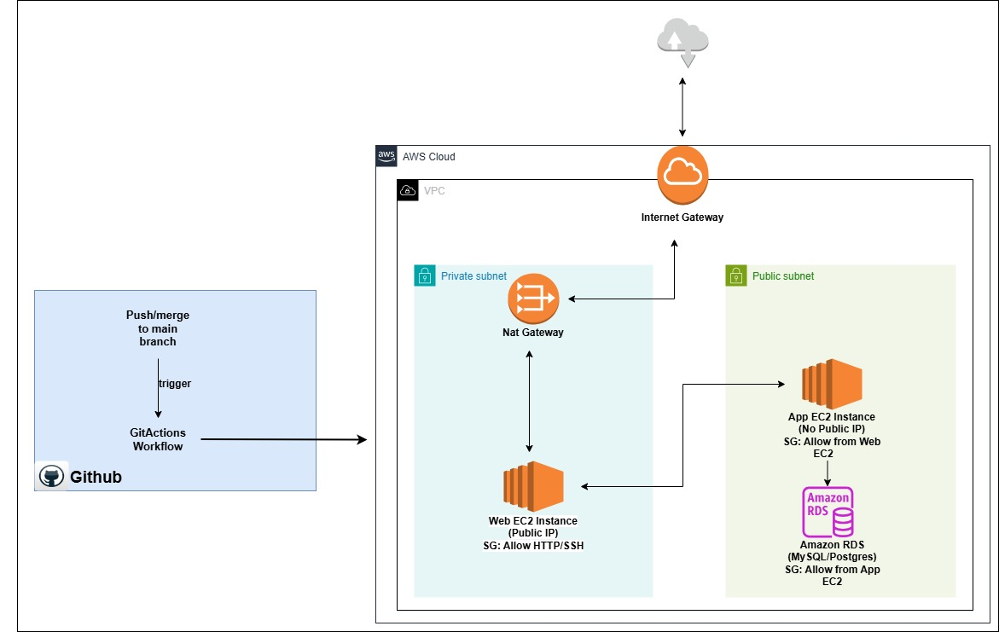

# 🏗️ 3-Tier AWS Architecture with Terraform

.

This project provisions a **highly secure and scalable 3-tier architecture** on AWS using Terraform. It consists of a **network layer**, **application layer**, **web layer**, and **database layer**, all integrated through Infrastructure as Code and deployed via **GitHub Actions**.

---

## 📌 Architecture Overview
```
Internet
|
[Internet Gateway]
|
[Public Subnet]
├── NAT Gateway
└── Web EC2 (Public IP)
|
[Private Subnet]
├── App EC2 (No Public IP)
└── RDS DB (Private Subnet)
```

- **Web Layer** (Public Subnet): Hosts the web server with a public IP.
- **App Layer** (Private Subnet): Hosts the application logic.
- **Database Layer** (Private Subnet): Hosts an RDS instance.
- **Networking**: VPC, Subnets, Routing Tables, NAT Gateway, IGW.

---

## 🧰 Technologies Used

- **Terraform** for infrastructure as code
- **AWS** (VPC, EC2, RDS, Subnets, NAT Gateway, IGW)
- **GitHub Actions** for CI/CD deployment

---

## 📂 Project Structure


---

## 🚀 Deployment Steps

### ✅ Step 1: Set Up Networking
- Creates a VPC with CIDR `10.0.0.0/16`
- Public and private subnets with route tables
- Internet Gateway for public internet access
- NAT Gateway for outbound access from private subnet

### ✅ Step 2: Deploy the Database Layer
- Amazon RDS instance deployed in a **private subnet**
- Security group restricts access only from the **application layer**

### ✅ Step 3: Deploy Application & Web Layer
- EC2 Instance (Web Layer) in **public subnet** with a **public IP**
- EC2 Instance (App Layer) in **private subnet**, **no public IP**
- Web → App → DB traffic flow ensured via security groups

### ✅ Step 4: Configure Security Groups & NACLs
- Security groups defined per layer:
  - Web: allow HTTP/SSH from internet
  - App: allow traffic from Web
  - DB: allow traffic from App
- Network ACLs manage subnet-level access

### ✅ Step 5: Test the Setup
- Access the Web EC2 via its public IP or domain name
- From Web EC2, SSH into the App EC2
- From App EC2, connect to the RDS database

---

## ⚙️ CI/CD with GitHub Actions

This project includes a GitHub Actions pipeline that automates:
- Terraform initialization (`terraform init`)
- Validation (`terraform validate`)
- Plan preview (`terraform plan`)
- Automatic infrastructure deployment (`terraform apply`)

Secrets such as `AWS_ACCESS_KEY_ID` and `AWS_SECRET_ACCESS_KEY` are stored securely in **GitHub Secrets**.

---

## ✅ Requirements

- Terraform ≥ 1.0
- AWS CLI & IAM credentials
- GitHub Repository with Secrets configured
- EC2 Key Pair (optional, for manual access)

---


